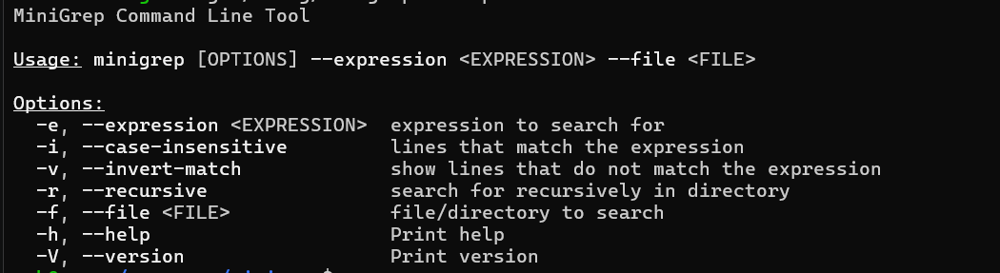

# MiniGrep

This is a simple command line tool I built using rust (mostly to learn how it works)

Utilizes the clap crate to filter cli arguments and native rust is used to fulfill every other function

## Usage:
do minigrep --help or minigrep -h for details!

**NOTE**: if recursive is set, file must be a path to a directory

## Future Implementations
**piping** functionality, I might do this in the future (when I figure out what '|' acctually does!)

**Regex** functionality - I hate regex with a passion so I try to avoid it when I can!  

